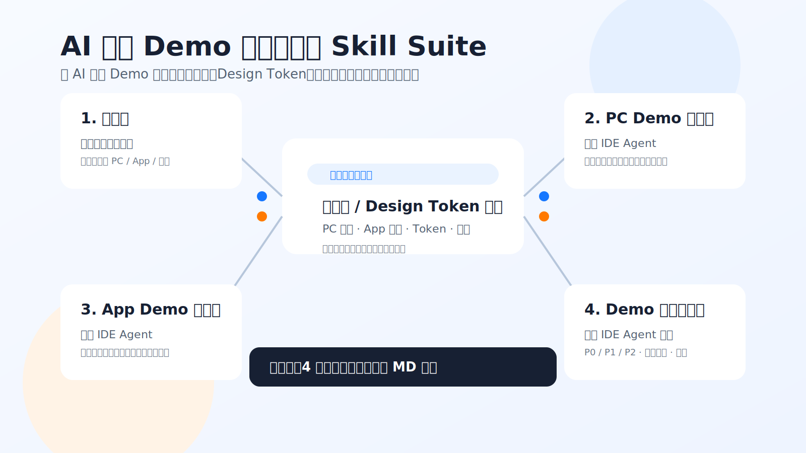

# AI 产品 Demo 设计与评审 Skill Suite

这套文档只解决一件事：让产品经理用 AI / IDE Agent 生成的 PC 或 App Demo，尽量符合公司设计规范、组件体系、Design Token、交互状态和产品化评审要求。

## 你现在只需要用这 4 个文档

| 场景 | 使用文档 | 发给谁 | 目的 |
| --- | --- | --- | --- |
| 先理解这套东西 | `00-总介绍-先看这个.md` | 团队内部 | 说明什么时候用哪个文档 |
| PC Demo 生成前 | `01A-PC-Demo生成前-文档输入版-发给IDE-Agent.md` | 产品文档 + 这份 Skill 一起发给 IDE Agent |
| App Demo 生成前 | `02A-App-Demo生成前-文档输入版-发给IDE-Agent.md` | 产品文档 + 这份 Skill 一起发给 IDE Agent |
| Demo 生成后审核 | `03A-Demo生成后-AI审核-文档输入版-发给IDE-Agent.md` | Demo 材料 + 产品文档 + 这份 Skill 一起发给 IDE Agent |

所有生成和审核场景都建议同时附上 `04-设计规范约束速查-给AI一起看.md`。这份文件现在是完整设计规范约束基座，包含 PC、App、Token、组件、状态、图表、文案、空状态、AI 场景和研发可落地规则，并已合并 `front-spec` 的 PC 真实组件/API 映射。

如果这次要生成或审核 PC 端真实代码，还要让 IDE Agent 读取：

- `/Users/zcy/Desktop/AI产品设计/spec-repository-main/nova-spec/front-spec/INDEX.md`
- 实际用到组件对应的 `api/*.md` 和 `design/*.md`

## 最简单使用方式

### 生成 PC Demo

1. 打开 `01A-PC-Demo生成前-文档输入版-发给IDE-Agent.md`。
2. 准备产品文档、PRD、页面说明或会议纪要。
3. 同时附上 `04-设计规范约束速查-给AI一起看.md`。
4. 把产品文档 + `01A` + `04` 一起发给 IDE Agent。
5. 如果要生成真实代码，同时要求读取 `front-spec/INDEX.md` 和实际组件 API。
6. 要求 IDE Agent 先读取产品文档、设计规范基座和组件/API，再生成 Demo。
7. 明确要求：UI 页面不要展示 Manifest、规范清单、需求摘要；这些内容只作为生成后的文本说明输出。

### 生成 App Demo

1. 打开 `02A-App-Demo生成前-文档输入版-发给IDE-Agent.md`。
2. 准备产品文档、PRD、页面说明或会议纪要。
3. 同时附上 `04-设计规范约束速查-给AI一起看.md`。
4. 把产品文档 + `02A` + `04` 一起发给 IDE Agent。
5. 要求 IDE Agent 先读取产品文档和设计规范基座，再生成移动端 Demo。

### Demo 生成后审核

1. 打开 `03A-Demo生成后-AI审核-文档输入版-发给IDE-Agent.md`。
2. 准备 Demo 链接、截图、录屏、产品文档、验收标准。
3. 同时附上 `04-设计规范约束速查-给AI一起看.md`。
4. 把 Demo 材料 + 产品文档 + `03A` + `04` 一起发给 IDE Agent。
5. 如果审核 PC 真实代码，同时要求读取 `front-spec/INDEX.md` 和实际组件 API。
6. 要求 IDE Agent 先读取材料、设计规范基座和组件/API，再输出审核报告。

## 不要怎么用

- 不要只发一句“帮我做一个后台页面”。
- 不要只发业务需求，不发组件/Token 约束。
- 不要把完整 `乐采设计规范` HTML 一次性全塞给 AI。
- 不要让 AI 自己发明颜色、圆角、阴影、组件样式。
- 不要把“产品规则没想清楚”包装成设计问题。
- 不要把 `Component / Token Usage Manifest`、设计规范执行摘要、需求摘要放进可视业务页面。

## 这 4 个文档背后引用了什么

这些 quick-use 文档已经整合了下列资料的核心内容：

- PC 组件映射：`shared/component-token-mapping/pc-component-map.md`
- PC 真实组件/API 映射：`shared/component-token-mapping/front-spec-real-component-map.md`
- App 组件映射：`shared/component-token-mapping/mobile-component-map.md`
- Design Token 映射：`shared/component-token-mapping/design-token-map.md`
- 组件状态映射：`shared/component-token-mapping/component-state-map.md`
- AI 审核清单：`shared/component-token-mapping/review-component-token-checklist.md`

正式项目中，产品经理优先使用本目录的流程文件 + `04` 两文件组合。`../daily-use/` 是 Lite 轻量试用包，适合快速试阅或上下文受限场景；只有需要深挖规范来源或维护规则时，再看 `shared/`、`skills/`、`evidence/`、`validation/` 和 `governance/`。
